# PROX-VOICE — Data Engineering Pipeline

The measurement study left behind a directory of per-run JSON exports, one
append-only stream of real-network reports, and a single Python script
(`experiments/aggregate.py`) that reduced them into the result tables. This
pipeline rebuilds that reduction as a medallion lakehouse.

Raw telemetry lands in bronze as Delta, provenance intact. Silver does the real
work — exploding the nested link arrays and flattening the per-client KPIs into
one fact table plus a table per experiment, all in PySpark. dbt builds and tests
the gold marts on top of that, Great Expectations adds a second round of
data-quality checks, and Airflow runs the stages end to end (an Azure Data Factory
pipeline mirrors it on the cloud side). The report figures that come from telemetry are drawn from the gold
marts; the acoustic-rig figures are built from the rig captures, outside the pipeline.

`aggregate.py` stays on as the reference. A parity step recomputes its numbers
from the raw JSON and checks the marts against them, so a mismatch fails the run
rather than reaching a figure.

```
experiments/data/**            (raw JSON + JSONL telemetry — the study's output)
        │
        ▼  ingest/land_raw.py
   bronze (Delta)               raw payload + provenance (source, type, ingest ts)
        │
        ▼  spark/bronze_to_silver.py  (transforms.py)
   silver (Delta)               link_fact grain + per-experiment tables
        │
        ▼  dbt (dbt-spark)
   gold (Delta marts)           kpi_vs_n · sensing_suppression · mobility_cycles
        │                        audiogap · realnet_conditions · gracegap_series · dtx_uplink
        ├──▶ figures/            10 report figures regenerated from the marts
        └──▶ validate/parity_check.py   gold == independent Python reduction of raw
```

## Stack

| Concern | Tool |
|---------|------|
| Storage / compute | PySpark 3.5 + Delta Lake (medallion bronze/silver/gold) |
| Transform tests | dbt-spark (staging views, gold marts, schema + singular tests) |
| Data quality | Great Expectations (silver-fact suite + gold-mart checkpoint) |
| Streaming | Event Hubs replay of the JSONL stream (local file fallback) |
| Orchestration | Airflow DAG + an Azure Data Factory `pipeline.json` equivalent |
| Parity gate | `validate/parity_check.py` vs the study's `aggregate.py` reducer |

## Layout

```
pipeline/
  config/pipeline.yml         roots + Azure bindings (local | azure)
  common/                     config loader, record-type + provenance stamping
  ingest/
    land_raw.py               bronze: JSON exports + JSONL stream → Delta
    eventhub_replay.py        streaming: frame + produce (Event Hubs / local)
  spark/
    schemas.py                explicit read schemas + silver-fact schema
    transforms.py             explode links, flatten KPIs, per-experiment normalizers
    bronze_to_silver.py       silver jobs (link-fact + experiment tables)
  dbt/                        dbt-spark project: silver staging + gold marts + tests
  quality/expectations/       Great Expectations suites + checkpoint
  figures/                    one script + PNG per report figure, shared style
  orchestration/              airflow_dag.py + adf_pipeline.json
  validate/parity_check.py    the parity gate
  run_pipeline.py             CLI driver (bronze | silver | figures | parity | all)
  Makefile                    end-to-end targets
```

## Running it

Prerequisites: Python 3.11 (PySpark 3.5 does not support 3.12+), a Spark-compatible
JDK (8/11/17 — the Makefile selects 17 via `/usr/libexec/java_home`), and the
raw telemetry already present under `../experiments/data/`.

```bash
cd pipeline
python3.11 -m venv .venv
make install          # pip install -r requirements.txt
make bronze silver    # land raw → bronze, build silver Delta tables
make dbt              # materialize gold marts + run dbt tests
make figures          # regenerate all report figures from the marts
make parity           # gate gold marts + figure series against aggregate.py
make test             # the pytest suite (pure logic + Spark transforms)
# or simply:
make all
```

`make dbt` copies `dbt/profiles.example.yml` to `dbt/profiles.yml` on first run;
it uses the dbt-spark **session** method so no external cluster is needed.

## Local ↔ Azure mapping

The pipeline runs locally against the checked-in telemetry. The same code runs on
Azure by pointing `config/pipeline.yml` at cloud roots (`mode: azure`); the table
maps each local component to its Azure equivalent.

| Local | Azure |
|-------|-------|
| Local filesystem Delta roots | ADLS Gen2 (`abfss://…`) |
| PySpark `local[*]` | Azure Databricks / Synapse Spark |
| dbt-spark session method | dbt-spark on Databricks SQL warehouse |
| JSONL file replay | Azure Event Hubs |
| Airflow DAG | Azure Data Factory pipeline (`orchestration/adf_pipeline.json`) |

## Figure gallery

Every figure is regenerated from its gold mart in the same style as the report.

| Figure | Shows | Gold mart |
|--------|-------|-----------|
| 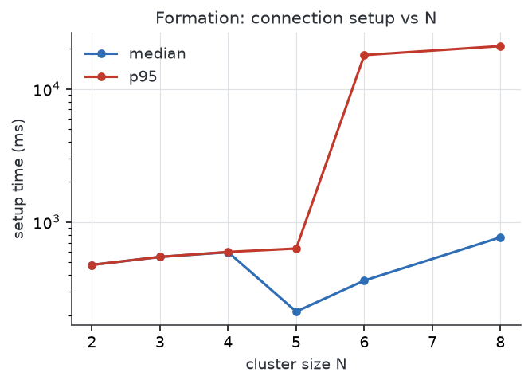 | setup time vs N (median / p95, semilog) | kpi_vs_n |
| 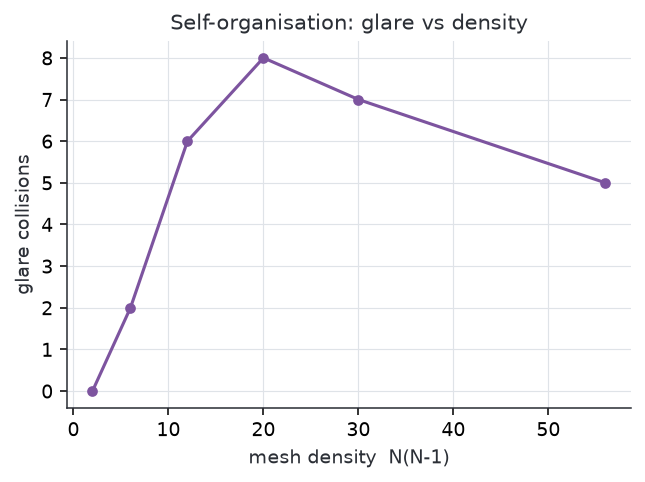 | glare vs mesh density N(N-1) | kpi_vs_n |
| 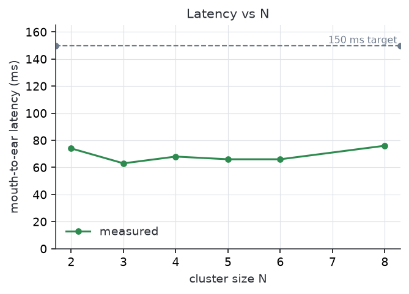 | mouth-to-ear latency vs N (150 ms target) | kpi_vs_n |
| 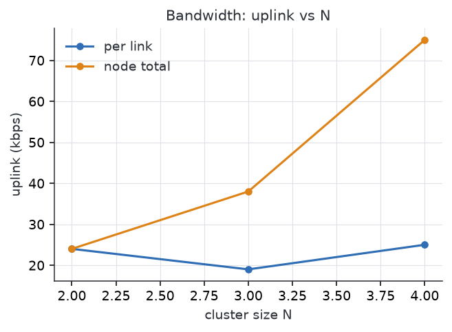 | uplink vs N (per-link and node total) | kpi_vs_n |
| 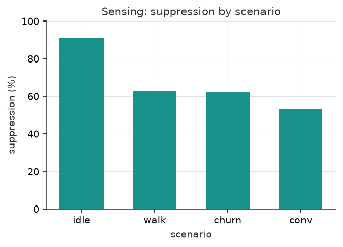 | sensor suppression by scenario | sensing_suppression |
| 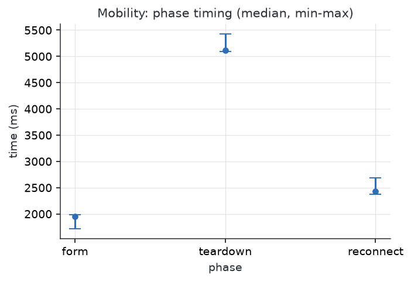 | mobility form / teardown / reconnect | mobility_cycles |
| 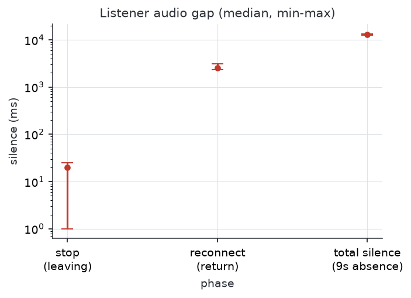 | listener audio gap (out-and-back) | audiogap |
| 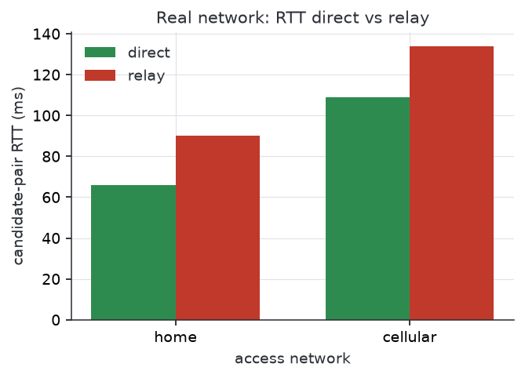 | real-network RTT, direct vs relay | realnet_conditions |
| 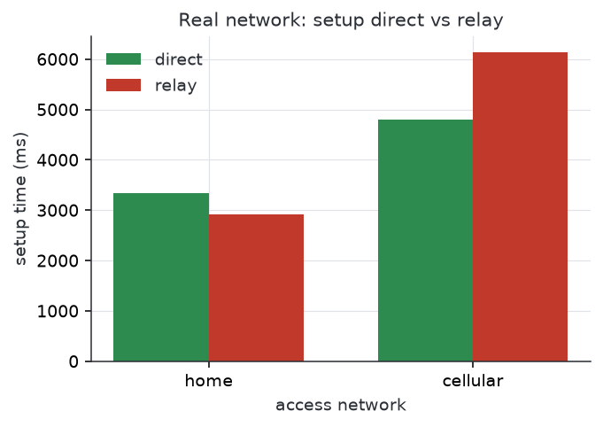 | real-network setup, direct vs relay | realnet_conditions |
| 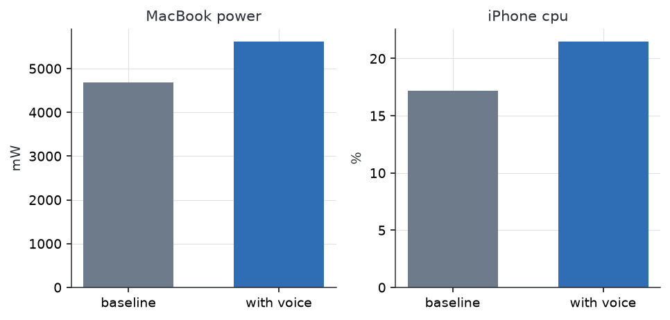 | device energy / CPU cost (two panels) | energy_readings.csv (manual) |
| 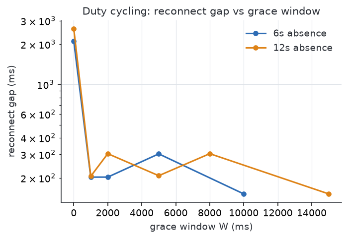 | grace-window duty-cycle sweep | gracegap_series |

## The parity gate

`validate/parity_check.py` recomputes the study's numbers from the raw JSON in
plain Python — a second implementation of the `aggregate.py` reductions — and
checks that the gold marts match within a rounding tolerance, and that the figure
series still reproduce the reported values. A mismatch fails the run.
